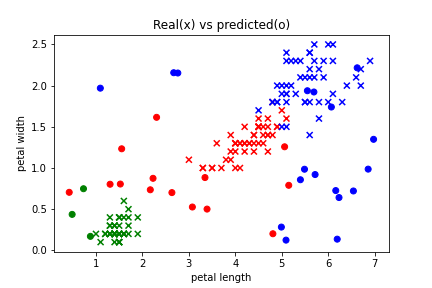

### Gaussian Naive Bayes Classifier

This is a simple implementation of a Gaussian Naive Classifier in python. Part of the probabilistic classifers [1], can acheive high accuracy on the given classification tasks.

Below the classifier is trained on the iris dataset[3] ```x```, than random samples are classified with it ```o```. 

<p align="center"> 
  </a>
</p>

### How to use it?

1. clone the project
2. import in your project the ```utils/gaussian_naive_classifier.py```
3. load and format the dataset for traning to have a layout of ```Sampple Nr x Labels + Features```
4. create an instance for "GaussianNaiveBayesClassifier" object ```gnb = GaussianNaiveBayesClassifier(labels=labels, label_data_indx=0, feature_data_indx=[1,2,3,4], return_class_label=True)```
5. train it with your data ```gnb.fit_data(data)```
6. use a data point to predict the class ```gnb.predict(sample)```


See details of a working example in ```naive_bayes.ipynb```, uses the iris [2] dataset for classifications.

### Resources
1. [Naive Bayes classifier](https://en.wikipedia.org/wiki/Naive_Bayes_classifier)
2. [Gaussian function](https://en.wikipedia.org/wiki/Gaussian_function)
3. [iris dataset, source and credits](https://archive.ics.uci.edu/ml/datasets/iris)

/Enjoy.
